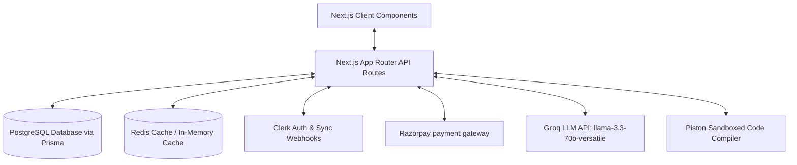
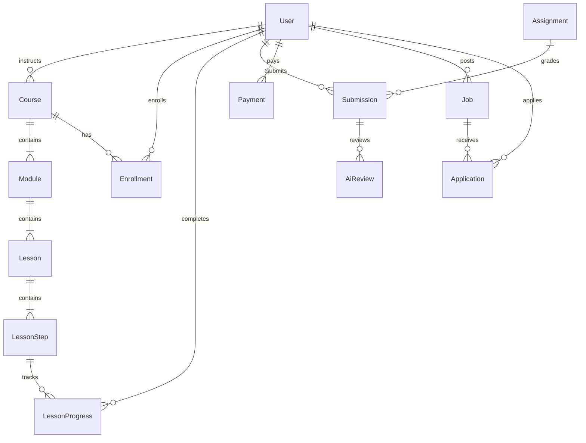

# SYSTEM REPORT: Skillzy (Skilotech) Full-Stack Interactive Learning Platform

Welcome to **Skillzy** (internally structured as **Skilotech** / **SkillBridge**), a state-of-the-art full-stack Interactive Learning Management System (LMS) and coding education platform built using **Next.js**.

This document serves as a comprehensive system report detailing the architecture, tech stack, data models, core modules, API endpoints, and development workflows of the project. It is designed to allow any AI model or developer to immediately understand the repository structure and begin working.

---

## 🗺️ System Architecture Overview

Skillzy uses a modular architecture combining a Next.js (App Router) web application with server-side caching, database persistence, external code execution sandboxes, and AI integration services.

### Core Component Interaction Flow


---

## 🛠️ Technology Stack

1. **Frontend & Framework**:
   * **React 19.2.4** and **Next.js 16.2.9 (App Router)**.
   * **Vanilla CSS Modules** for premium styling (no Tailwind CSS, ensuring maximum layout control).
   * **Framer Motion** for premium interactive animation transitions and micro-animations.
   * **Monaco Editor** (`@monaco-editor/react`) for the in-browser IDE student coding workspace.
   * **Lucide React** for icons, **Sonner** for clean toast notifications.

2. **Backend, Database, & Cache**:
   * **PostgreSQL** database powered by **Prisma ORM 5.22.0**.
   * **Redis Cache** (`ioredis`) for curriculum queries, featuring a robust, automated in-memory fallback cache manager (`InMemoryCache` defined in [redis.ts](file:///c:/Users/bonde/AI/skillzy/Skillzy/src/lib/redis.ts)) in case Redis is not configured or goes down.

3. **External Services & APIs**:
   * **Authentication**: Clerk (`@clerk/nextjs`) with automated webhook synchronization ([clerk/route.ts](file:///c:/Users/bonde/AI/skillzy/Skillzy/src/app/api/webhooks/clerk/route.ts)) to sync profiles to the database.
   * **Payments**: Razorpay direct checkout integration in INR (₹) ([RazorpayCheckout.tsx](file:///c:/Users/bonde/AI/skillzy/Skillzy/src/components/payments/RazorpayCheckout.tsx)).
   * **Code Compilation Sandbox**: Piston API (running at `https://compiler.roletwit.in`) for sandboxed execution of four primary languages: **JavaScript**, **Python**, **C++**, and **Java**.
   * **Socratic AI Tutor & Automated Feedback**: Groq API using the `llama-3.3-70b-versatile` model to evaluate code structure, list logical errors, generate hints without giving direct solutions, format raw texts to Markdown, and build progress reports ([socraticTutorAgent.ts](file:///c:/Users/bonde/AI/skillzy/Skillzy/src/lib/socraticTutorAgent.ts)).

---

## 📂 Project Directory Structure

Below is an overview of the key directories and files:

```
Skillzy/
├── prisma/                    # Database models and seeding scripts
│   ├── schema.prisma          # Database source of truth schema
│   ├── seed.ts                # Main seed file (users, categories, courses, modules, lessons)
│   └── seed-problems.ts       # Main seed file for coding problems
├── public/                    # Static assets, logos, thumbnails
├── src/
│   ├── app/                   # App Router files
│   │   ├── api/               # API endpoint handlers
│   │   │   ├── ai/            # AI services (formatting, tutoring)
│   │   │   ├── compile/       # Monaco compiler route with test execution
│   │   │   ├── payments/      # Razorpay order checkout and verification
│   │   │   └── webhooks/      # Clerk & Razorpay webhook receivers
│   │   ├── dashboard/         # Main workspace views partitioned by role
│   │   │   ├── admin/         # Administrative console
│   │   │   ├── coding-lab/    # Interactive Coding Lab
│   │   │   ├── community/     # Discussion boards
│   │   │   ├── courses/       # Course browser and Learn Workspace
│   │   │   ├── instructor/    # Course builder and outlines manager
│   │   │   └── recruiter/     # Recruitment portal
│   │   ├── globals.css        # Global CSS stylesheet (design system variables)
│   │   ├── layout.tsx         # Next.js root layout
│   │   └── page.tsx           # Home landing page with motion animations
│   ├── components/            # UI Components
│   │   ├── layout/            # Sidebar, Header, and DashboardLayout elements
│   │   ├── payments/          # Razorpay modal checkout wrappers
│   │   └── ui/                # Custom inputs, cards, filters, tables, progress indicators
│   ├── context/               # Global states (AuthContext)
│   ├── lib/                   # Utility helpers and API middleware
│   │   ├── auth.ts            # Clerk integrations, session helpers, roles checks
│   │   ├── compiler.ts        # Piston sandbox runner client (rate limiter, size guards)
│   │   ├── redis.ts           # Redis client setup with automatic in-memory fallback
│   │   ├── socraticTutorAgent.ts  # Groq AI prompt templates and execution pipelines
│   │   └── validations.ts     # Zod verification schemas for client/server payloads
│   └── services/              # External service configurations
├── AGENTS.md                  # Development guidelines for AI Agents (React 19 & Next 16)
├── README.md                  # Local execution guide and prerequisites checklist
└── package.json               # Module dependencies and scripts
```

---

## 🗄️ Database Models (Prisma Schema)

The database schema defined in [schema.prisma](file:///c:/Users/bonde/AI/skillzy/Skillzy/prisma/schema.prisma) supports a wide range of features.



### Key Models List

*   **`User`**: Profiles synced from Clerk. Has a `role` field supporting:
    *   `student`: Standard learner role.
    *   `instructor`: Can create, manage, and outline courses.
    *   `recruiter`: Can post job positions and manage candidates.
    *   `admin` / `super_admin`: Full administrative dashboard visibility.
*   **Curriculum Structure**:
    *   `Category` -> `Course` -> `Module` -> `Lesson` -> `LessonStep`
    *   `LessonStepType` supports: `intro`, `text`, `video`, `lab`.
    *   Lab steps include compiler config fields: `labLanguage`, `labStarterCode`, `labSolutionCode`, `labInstructions`, `labTestCode`.
*   **Progress Tracking**:
    *   `Enrollment`: Represents student-course enrollment. Tracks progress percent (`progressPct`) and certificates.
    *   `LessonProgress`: Logs completed steps (`isCompleted`) and durations (`timeSpentSecs`).
*   **Payments & Invoicing**:
    *   `Payment`: Links orders directly to Razorpay tracking (`razorpayOrderId`, `razorpayPaymentId`, `status`, `amount`, `method`).
    *   `Invoice`: Generates transactional invoice documents with tax specifications.
*   **Assignments & AI Evaluation**:
    *   `Assignment`: Worksheets or code tasks linked to courses/modules.
    *   `Submission`: Code or text answers uploaded by students.
    *   `AiReview`: Stores Groq feedback (overall score, strengths, improvements, style, performance, security, complexity, and tokens count).
*   **Community Forums**:
    *   `CommunityPost` / `Comment`: Multi-level discussion boards.
    *   `PostLike` / `CommentLike`: Interaction metrics counters.
*   **Recruitment**:
    *   `Job`: Postings containing salary specifications, company logs, locations, and requirements.
    *   `Application`: Candidate resume links, statuses, and AI matching scores.
*   **Practice Sandbox**:
    *   `CodingProblem`: Independent coding tasks containing starter templates, difficulty, and assertions.

---

## 💻 Interactive Code Execution & Testing Engine

A core feature of Skillzy is in-browser sandboxed code execution, managed by [compiler.ts](file:///c:/Users/bonde/AI/skillzy/Skillzy/src/lib/compiler.ts) and triggered through the `/api/compile` route ([route.ts](file:///c:/Users/bonde/AI/skillzy/Skillzy/src/app/api/compile/route.ts)).

### How Code Execution Works:
1. **Monaco Editor Integration**: The student writes code in JavaScript, Python, C++, or Java.
2. **Post API Call**: A `POST` request is sent to `/api/compile` containing the student code, language, and the target step or problem ID.
3. **Test Assertion Aggregation**: The backend loads `labTestCode` (for a Lesson Step) or `testCode` (for a Coding Problem) corresponding to the selected language.
4. **Code Wrapping**: 
   * For **C++**, the student's `main()` is renamed to `student_main()` via regex to avoid duplicate entry symbol errors, and test assertions are appended at the bottom.
   * For **Java**, the class `Main` is renamed to `StudentSolution`, and the compiler test suite runner is appended.
   * For **Python** and **JavaScript**, assertion frameworks are appended dynamically.
5. **Piston API Compilation**: The backend sends the bundled code package to Piston (`https://compiler.roletwit.in/api/v2/execute`). Rate-limiting (30 requests/min per user) and code limits (64KB max) are enforced.
6. **Execution Output Cleaning**: Internal markers (e.g. `[TEST_CASE]`) are parsed out of stdout/stderr, and a detailed list of passed/failed test cases is returned.
7. **AI Socratic Tutor Feedback**: If the user submits or requests AI help (`askAi: true`), the error is sent to Groq (`llama-3.3-70b-versatile`). It provides high-level conceptual hints and next-step guides without displaying the direct answer.

---

## 🔗 Key API Mappings

All endpoints require authorization via `requireAuth()` or `requireRole()` checks from [auth.ts](file:///c:/Users/bonde/AI/skillzy/Skillzy/src/lib/auth.ts).

*   **Compilation & AI Tutor**:
    *   `POST` [src/app/api/compile/route.ts](file:///c:/Users/bonde/AI/skillzy/Skillzy/src/app/api/compile/route.ts) — Executes student code, evaluates test cases, and runs Socratic tutoring analysis on failure.
    *   `POST` [src/app/api/ai/format-content/route.ts](file:///c:/Users/bonde/AI/skillzy/Skillzy/src/app/api/ai/format-content/route.ts) — Beautifies course titles/descriptions into markdown using Groq.
*   **Payments & Subscriptions**:
    *   `POST` `/api/payments/create-order` — Initiates an INR payment order on Razorpay for a course.
    *   `POST` `/api/payments/verify` — Validates Razorpay signatures and activates student enrollment on success.
*   **Webhooks Listener**:
    *   `POST` [src/app/api/webhooks/clerk/route.ts](file:///c:/Users/bonde/AI/skillzy/Skillzy/src/app/api/webhooks/clerk/route.ts) — Synchronizes Clerk registration, profile updates, and cancellations in real-time.
    *   `POST` `/api/webhooks/razorpay` — Backup verification listener.
*   **Curriculum Management**:
    *   `GET` / `POST` `/api/courses` — Course catalog access and creation.
    *   `PUT` / `DELETE` `/api/courses/[id]` — Modify status (`draft`, `published`, `archived`) or properties.
    *   `POST` `/api/modules` / `/api/lessons` / `/api/steps` — Manage course structure, sorting order, and step payloads.
*   **Jobs & Placement**:
    *   `GET` / `POST` `/api/jobs` — Job listings and applicant dashboard updates.
    *   `POST` `/api/jobs/apply` — Student applications submission, uploading resumes, and scoring matches.

---

## ⚠️ Custom Next.js 16 constraints & guidelines

> [!WARNING]
> This project uses **Next.js 16** and **React 19 (Canary)**. Certain patterns might differ from typical Next.js versions.

*   **Rule reference**: See [AGENTS.md](file:///c:/Users/bonde/AI/skillzy/Skillzy/AGENTS.md).
*   **Instant Navigation**: If implementing or debugging slow client-side routing, standard `<Suspense>` alone is not sufficient in this version. You **must** also export `unstable_instant` from the route file.
*   Refer to local guidelines under `node_modules/next/dist/docs/01-app/` before adding major routing patterns.
*   Keep components Tailwind-free. Use Vanilla CSS files ending in `.module.css`.

---

## 🚀 Setting Up the Environment Locally

### 1. Prerequisites
Ensure you have the following installed:
*   **Node.js** (v20+ recommended)
*   **PostgreSQL** (running instance)
*   **Redis** (optional - if omitted, it defaults to a clean, in-memory cache simulator automatically)

### 2. Environment Configurations (`.env`)
Create a `.env` file in the root directory:
```env
# Database Credentials
DATABASE_URL="postgresql://<user>:<password>@localhost:5432/<db_name>?schema=public"

# Redis Cache Connection (Optional: will fallback to in-memory if empty)
REDIS_URL="redis://localhost:6379"

# Clerk Auth Keys
NEXT_PUBLIC_CLERK_PUBLISHABLE_KEY=pk_test_...
CLERK_SECRET_KEY=sk_test_...
NEXT_PUBLIC_CLERK_SIGN_IN_URL=/sign-in
NEXT_PUBLIC_CLERK_SIGN_UP_URL=/sign-up

# Razorpay Keys
RAZORPAY_KEY_ID=rzp_test_...
RAZORPAY_KEY_SECRET=...

# Webhook Secrets
CLERK_WEBHOOK_SECRET=whsec_...

# AI model Configuration
GROQ_API_KEY=gsk_...
GROQ_MODEL=llama-3.3-70b-versatile
```

### 3. Commands Sequence

```bash
# Install dependencies
npm install

# Build database schema structure
npx prisma db push

# Seed curriculum, users, assignments and problems
npx prisma db seed

# Run the local Next.js development server
npm run dev
```

Platform should now be live at [http://localhost:3000](http://localhost:3000).

---

*This system report has been compiled and checked for correctness. Any new coding agent or developer can refer to it to gain deep context on Skillzy's structural architecture.*
